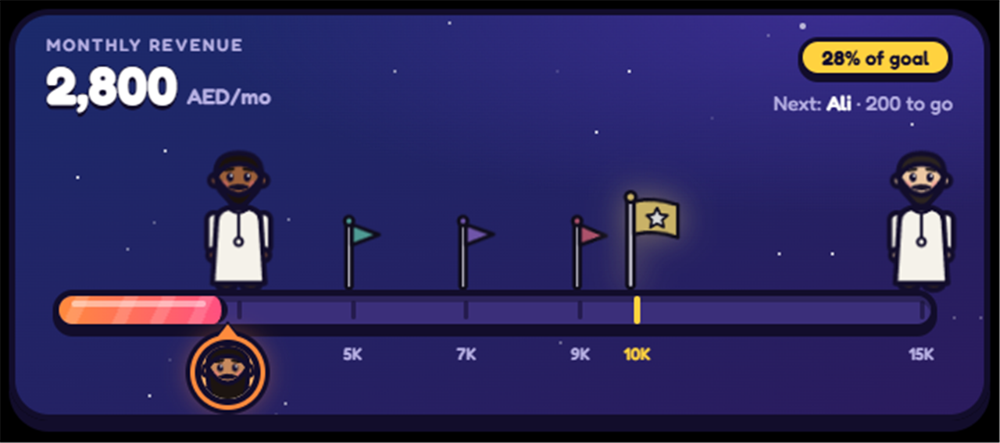
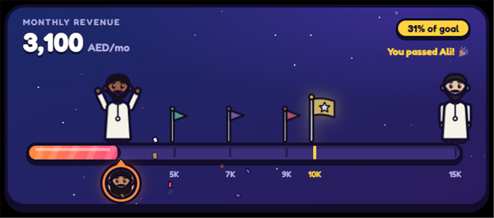

# Income Ladder

A small desktop widget (Tauri v2) that shows monthly revenue climbing a ladder of milestones toward the 10K AED goal.



When you pass a milestone:



## Changing things

Everything lives in **`%APPDATA%\com.ahmad.incomeladder\ladder.json`**. You can open it from the tray menu with **Open ladder.json**. The widget picks up edits within about 3 seconds.

- `current`: this month's revenue. You can also double-click the number on the widget, type the new amount and press Enter.
- `goal`, `scaleMax`: the goal (gold flag) and the right end of the bar.
- `milestones[]`: each one has `amount`, `name`, `note` (shown on hover) and `kind`:
  - `person`: a character, drawn from its `look` (see below)
  - `flag`: a small flag in its `color`
  - `goal`: the big gold flag
- A `look` has `skin`, `hair`, `beard` (`none`/`short`/`full`/`long`), `beardColor`, `outfit` and `headwear` (`none`/`ghutra`).
- `you.look`: your face on the orange badge.

When you pass a milestone, that character cheers and confetti goes off.

## Tray menu
Edit amount · Open ladder.json · Always on top · Start with Windows · Move to corner · Quit

## Dev
The build output goes to `D:/build/income-ladder/target` (see `src-tauri/.cargo/config.toml`).
This machine's VS 18 install is missing its C headers, so build through the VS 2019 env wrapper:

```
D:\build\income-ladder\cargo-vs.cmd npm run tauri dev
D:\build\income-ladder\cargo-vs.cmd npm run tauri build
npm test            # ladder maths
cd src-tauri && D:\build\income-ladder\cargo-vs.cmd cargo test
```
